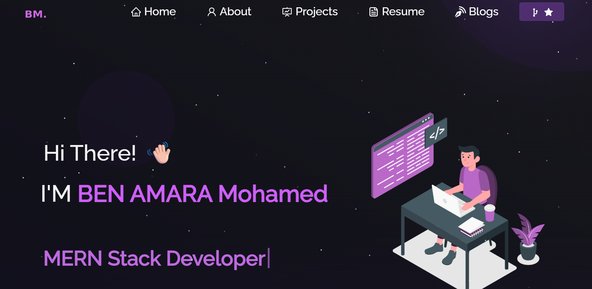

<h2 align="center">
  BEN AMARA Mohamed Adem - Portfolio 2026<br/>
  <a href="https://github.com/Mohamedademm" target="_blank">Full Stack Developer</a>
</h2>

<div align="center">
  
</div>

<br/>

<div align="center">

[](https://forthebadge.com) &nbsp;
[](https://forthebadge.com)

</div>

<h3 align="center">
    Computer System Development Student at ISET Sousse<br/>
    Passionate about Web Development, AI, and Competitive Programming
</h3>

---

## 👨‍💻 About Me

I'm **Mohamed Adem BEN AMARA**, a computer system development student from **Monastir, Tunisia**, graduating in 2025 from ISET Sousse. 

I'm skilled in:
- � **Programming:** C, C++, Java, Python, JavaScript, PHP
- 🌐 **Web Development:** React, Angular, Node.js, Spring Boot, Symfony
- 📱 **Mobile Development:** Flutter
- 🗄️ **Databases:** MongoDB, PostgreSQL, MySQL, Firebase
- 🤖 **Interests:** AI, Big Data, Competitive Programming

## 🛠️ Built With

This portfolio showcases my projects, skills, and resume. It was built using modern web technologies:

- **React.js** - Frontend framework
- **React Router** - Navigation
- **React Bootstrap** - UI components
- **React Icons** - Icon library
- **Particles.js** - Interactive background
- **CSS3** - Custom styling
- **GitHub Pages / Vercel** - Deployment

## ✨ Features

- **📖 Multi-Page Layout** - Home, About, Projects, Resume sections
- **🎨 Modern Design** - Dark theme with purple accents
- **📱 Fully Responsive** - Works perfectly on mobile, tablet, and desktop
- **⚡ Fast & Optimized** - Built with React best practices
- **🎭 Smooth Animations** - Particles.js background and smooth transitions
- **� Downloadable Resume** - CV available in PDF format

## Getting Started

Clone down this repository. You will need `node.js` and `git` installed globally on your machine.

## 🛠 Installation and Setup Instructions

1. Installation: `npm install`

2. In the project directory, you can run: `npm start`

Runs the app in the development mode.\
Open [http://localhost:3000](http://localhost:3000) to view it in the browser.
The page will reload if you make edits.

## 📂 Project Structure

```
Portfolio-master/
├── public/
│   ├── index.html
│   └── manifest.json
├── src/
│   ├── components/
│   │   ├── Home/       # Home page components
│   │   ├── About/      # About page with skills
│   │   ├── Projects/   # Project showcase
│   │   └── Resume/     # Resume viewer
│   ├── Assets/         # Images and resources
│   ├── App.js          # Main app component
│   └── style.css       # Global styles
└── package.json
```

## 🤝 Connect with Me

- **GitHub:** [@Mohamedademm](https://github.com/Mohamedademm)
- **LinkedIn:** [Mohamed Adem](https://www.linkedin.com/in/mohamed-adem-20mt047147/)
- **Instagram:** [@adem.mohamed0](https://www.instagram.com/adem.mohamed0)

## 📄 License

This project is open source and available under the MIT License.

---

### ⭐ Show your support

Give a ⭐ if you like this portfolio!
