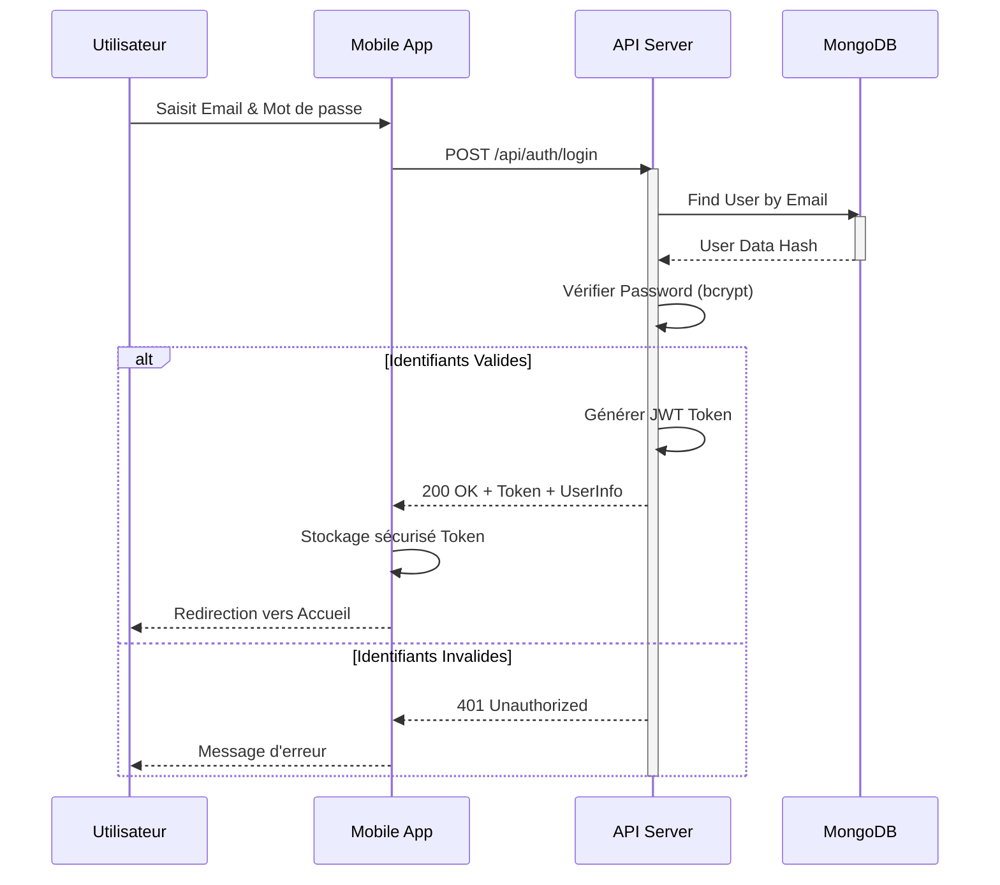
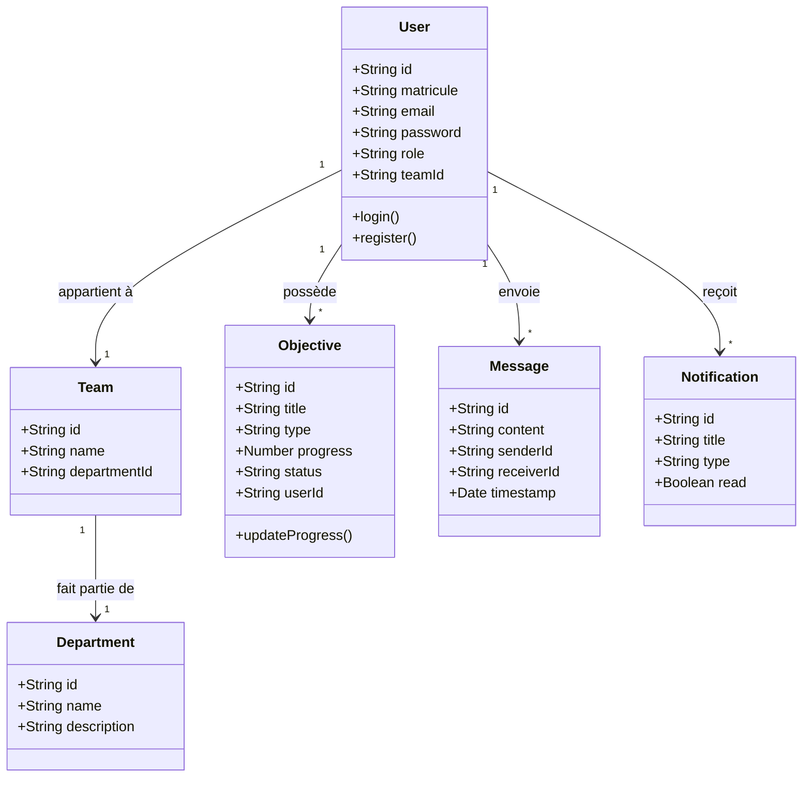
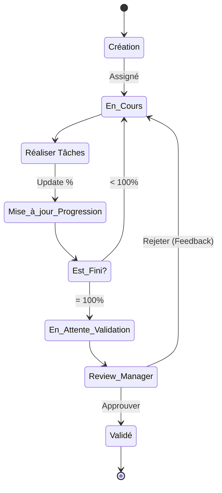

# Chapitre 2 : Conception

Ce chapitre détaille la phase de conception de l'application "Employee Communication App". Nous y présentons la modélisation statique et dynamique du système à l'aide du langage UML (Unified Modeling Language), permettant de visualiser l'architecture logicielle, les interactions entre les acteurs et la structure des données.

## 2.1 Diagramme de séquence

Les diagrammes de séquence illustrent les interactions entre les acteurs et le système au fil du temps pour un scénario donné.

**Scénario : Processus d'Authentification Sécurisée**
Ce diagramme montre les échanges lors d'une tentative de connexion d'un utilisateur, incluant la vérification des identifiants et la génération du Token JWT.



### 2.1.1 Diagramme de cas d’utilisation raffiné de point de vue utilisateur

L'acteur "Utilisateur" (Employé) est le principal bénéficiaire du système. Ses cas d'utilisation se concentrent sur la communication et la gestion opérationnelle quotidienne.

**(Adaptation au contexte : "Utilisateur" correspond ici au rôle "Employee")**

Les fonctionnalités principales sont :
*   **Messagerie** : Envoyer/recevoir messages, fichiers, créer des groupes.
*   **Objectifs** : Consulter ses objectifs, mettre à jour la progression.
*   **Profil** : Gérer ses informations personnelles.

```mermaid
usecaseDiagram
    actor "Employé" as E
    package "Espace Employé" {
        usecase "Envoyer Message Individuel" as UC1
        usecase "Participer Chat de Groupe" as UC2
        usecase "Consulter Objectifs" as UC3
        usecase "Mettre à jour Progression" as UC4
        usecase "Partager Localisation" as UC5
        usecase "Mettre à jour Profil" as UC6
    }
    
    E --> UC1
    E --> UC2
    E --> UC3
    E --> UC4
    E --> UC5
    E --> UC6
    
    UC4 ..> UC3 : extends
```

### 2.1.2 Diagramme de cas d’utilisation raffiné de point de vue manager

*(Note : Dans le contexte de l'application Draexlmaier, le rôle "Enseignant" de votre modèle correspond au rôle de "Manager" ou "Superviseur").*

Le Manager possède des privilèges étendus pour piloter son équipe. Il hérite des fonctionnalités de l'employé mais dispose d'outils de supervision.

**Fonctionnalités spécifiques :**
*   **Validation** : Approuver ou rejeter les objectifs soumis par les employés.
*   **Supervision** : Visualiser la localisation de l'équipe et les statistiques de performance.
*   **Communication** : Créer des canaux de communication dédiés à son équipe.

```mermaid
usecaseDiagram
    actor "Manager" as M
    package "Espace Manager" {
        usecase "Créer Objectif pour Équipe" as UC_M1
        usecase "Valider Objectifs Employé" as UC_M2
        usecase "Suivre Performance Équipe" as UC_M3
        usecase "Consulter Localisation Équipe" as UC_M4
        usecase "Gérer Réunion Équipe" as UC_M5
    }

    M --> UC_M1
    M --> UC_M2
    M --> UC_M3
    M --> UC_M4
    M --> UC_M5
```

### 2.1.3 Diagramme de cas d’utilisation raffiné de point de vue administrateur

L'administrateur a une vue globale et technique du système. Il ne participe pas nécessairement aux opérations métier (chats, objectifs) mais assure la maintenance et la gestion des accès.

```mermaid
usecaseDiagram
    actor "Administrateur" as A
    package "Back-office Admin" {
        usecase "Gérer les Comptes Utilisateurs" as UC_A1
        usecase "Gérer Départements & Équipes" as UC_A2
        usecase "Valider Inscriptions" as UC_A3
        usecase "Gérer les Matricules" as UC_A4
        usecase "Configurer Arrêts de Bus" as UC_A5
    }

    A --> UC_A1
    A --> UC_A2
    A --> UC_A3
    A --> UC_A4
    A --> UC_A5
```

### 2.1.4 Les cas d’utilisation de l’acteur administrateur

Cette section détaille les interactions complexes de l'administrateur :

1.  **Gérer les Comptes Utilisateurs (CRUD)** :
    *   *Description* : Créer, modifier, désactiver ou supprimer un compte.
    *   *Flux* : L'admin recherche un utilisateur, accède à sa fiche, modifie le rôle (ex: promotion d'un employé en manager) ou le statut.

2.  **Gérer la Structure (Départements/Équipes)** :
    *   *Description* : Modéliser l'organigramme de l'entreprise.
    *   *Importance* : Essentiel pour que les groupes de chat automatiques fonctionnent (chaque département a son groupe).

3.  **Valider les Inscriptions** :
    *   *Description* : Pour la sécurité, toute auto-inscription doit être approuvée.
    *   *Flux* : L'admin reçoit une notification, vérifie le matricule, et active le compte.


    *   **Gérer les Matricules** :
        *   *Description* : Gérer les matricules des employés.
        *   *Flux* : L'admin peut ajouter, modifier, supprimer ou désactiver un matricule.

    *code de diagramme de use cas admine 
    @startuml
title Diagramme de cas d’utilisation — Acteur Administrateur (Admin)
left to right direction

' ===== Style =====
skinparam shadowing false
skinparam backgroundColor white
skinparam packageStyle rectangle
skinparam actorStyle awesome
skinparam roundcorner 12
skinparam ArrowColor #333333
skinparam ArrowThickness 1
skinparam DefaultFontName Arial
skinparam DefaultFontSize 12

skinparam rectangle {
  BorderColor #222222
}
skinparam usecase {
  BackgroundColor #FFFFFF
  BorderColor #222222
}

actor "Administrateur" as ADM

rectangle "App" as SYS {

  package "Authentification" {
    ( S'authentifier ) as UC01
  }

  package "Administration" {
    (Gérer Comptes ) as UC10
    (Gérer Départements) as UC11
    (Valider Inscriptions) as UC12
    (Modifier son Profil) as UC13
    (Modifier Paramètres Application) as UC14
    (Gérer  Objectifs) as UC15
    (Gérer  Notifications) as UC16
  }
}

' --- Associations acteur ---
ADM --> UC10
ADM --> UC11
ADM --> UC12
ADM --> UC13
ADM --> UC14
ADM --> UC15
ADM --> UC16

' --- Include : Authentification obligatoire ---
UC10 ..> UC01 : <<include>>
UC11 ..> UC01 : <<include>>
UC12 ..> UC01 : <<include>>
UC13 ..> UC01 : <<include>>
UC14 ..> UC01 : <<include>>
UC15 ..> UC01 : <<include>>
UC16 ..> UC01 : <<include>>


@enduml


## 2.2 Diagramme de Classe

Le diagramme de classe représente la structure statique du système, les classes, leurs attributs et les relations entre elles. Il reflète directement notre schéma de base de données MongoDB (Mongoose).



## 2.3 Diagramme d’Activité

Le diagramme d'activité modélise le flux de travail (workflow) d'un processus complexe.
**Processus modélisé : Cycle de vie d'un Objectif (Création → Validation)**

Ce diagramme montre comment un objectif est créé par un employé ou un manager, travaillé, puis validé.



## 2.4 Conclusion

La phase de conception a permis de définir une architecture claire et robuste pour l'application. 
*   Les **diagrammes de cas d'utilisation** ont délimité précisément le périmètre fonctionnel pour chaque acteur (Employé, Manager, Admin).
*   Le **diagramme de classe** a structuré notre base de données pour gérer efficacement les relations complexes entre utilisateurs, équipes et objectifs.
*   Les **diagrammes de séquence et d'activité** ont validé la logique des processus métier critiques comme l'authentification et la gestion des objectifs.

Cette conception solide servira de référence tout au long de la phase de développement et d'implémentation présentée dans le chapitre suivant.
